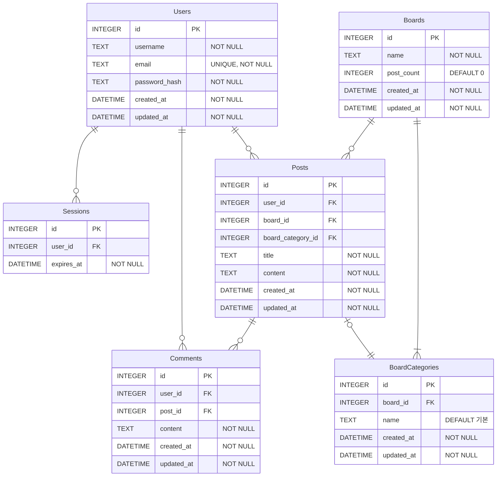

# ERD

```mermaid
erDiagram
  Users {
    INTEGER id PK
    TEXT username "NOT NULL"
    TEXT email "UNIQUE, NOT NULL"
    TEXT password_hash "NOT NULL"
    DATETIME created_at "NOT NULL"
    DATETIME updated_at "NOT NULL"
  }
  Sessions {
    INTEGER id PK
    INTEGER user_id FK
    DATETIME expires_at "NOT NULL"
  }
  Posts {
    INTEGER id PK
    INTEGER user_id FK
    INTEGER board_id FK
    INTEGER board_category_id FK
    TEXT title "NOT NULL"
    TEXT content "NOT NULL"
    DATETIME created_at "NOT NULL"
    DATETIME updated_at "NOT NULL"
  }
  Comments {
    INTEGER id PK
    INTEGER user_id FK
    INTEGER post_id FK
    TEXT content "NOT NULL"
    DATETIME created_at "NOT NULL"
    DATETIME updated_at "NOT NULL"
  }
  Boards {
    INTEGER id PK
    TEXT name "NOT NULL"
    INTEGER post_count "DEFAULT 0"
    DATETIME created_at "NOT NULL"
    DATETIME updated_at "NOT NULL"
  }
  BoardCategories {
    INTEGER id PK
    INTEGER board_id FK
    TEXT name "DEFAULT 기본"
    DATETIME created_at "NOT NULL"
    DATETIME updated_at "NOT NULL"
  }
  Users ||--o{ Sessions : ""
  Boards ||--|{ BoardCategories : ""
  Boards ||--o{ Posts : ""
  Users ||--o{ Posts : ""
  Posts ||--o{ Comments : ""
  Posts |o--|| BoardCategories : ""
  Users ||--o{ Comments : ""
```
